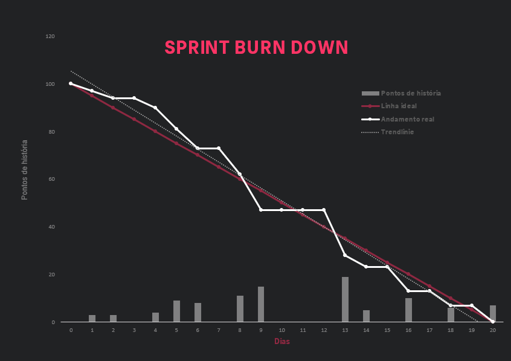
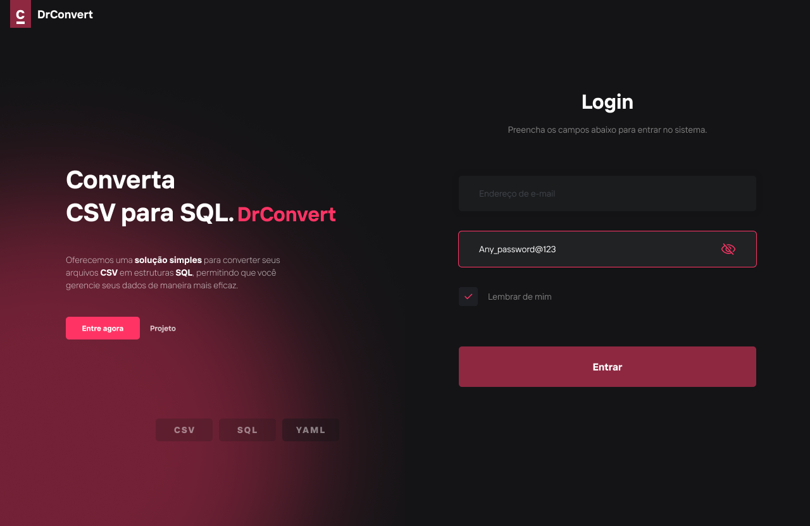
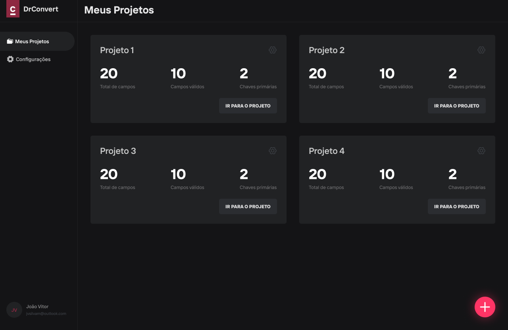
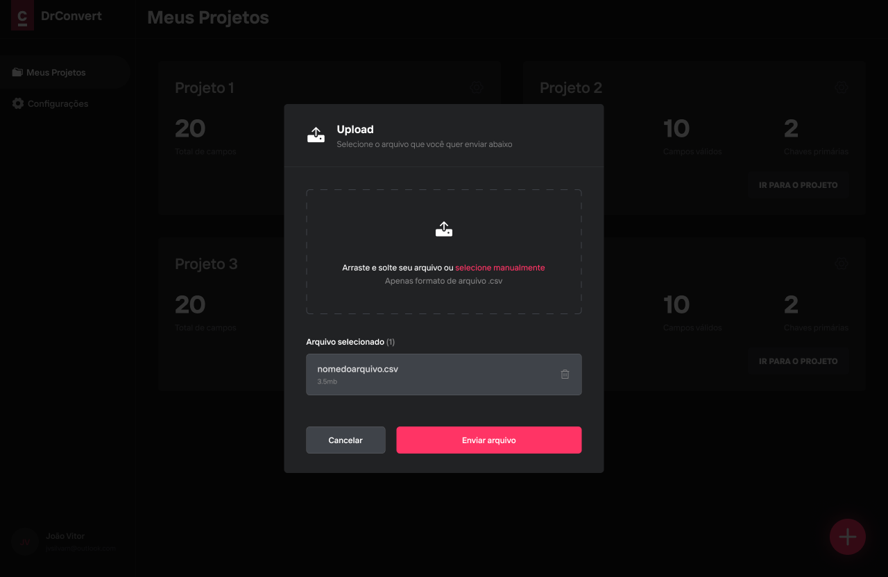
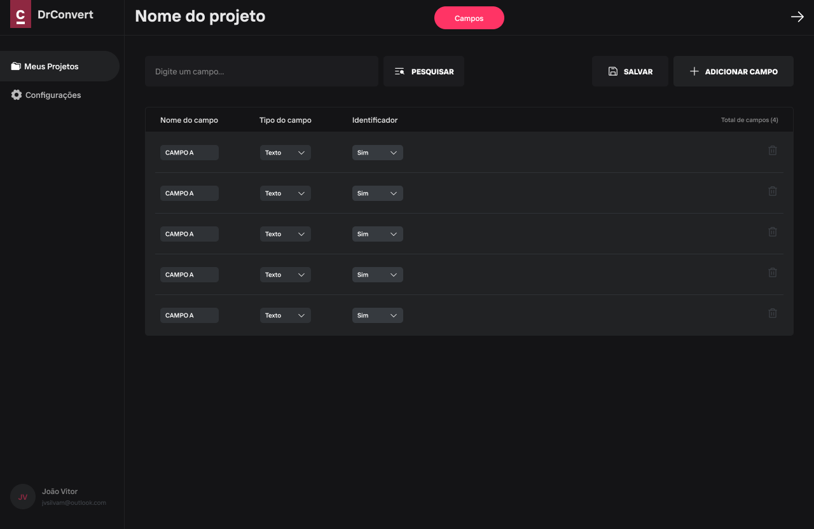

# Documentação da Sprint 1 - DrConvert

## 🕛 Cronograma

#### Sprint 1: 25/03 - 14/04

 

## 📃 Backlog

  <table>
    <tr>
      <td><b>Estória</b></td>
      <td><b>Critérios de Aceitação</b></td>
      <td><b>Prioridade</b></td>
      <td><b>Requisitos</b></td>
      <td><b>Sprint</b></td>
    </tr>
    <tr>
      <td>Eu, como Administrador, desejo Cadastrar usuários, para que eu possa Permitir o acesso dos usuário ao sistema</td>
      <td>Somente o administrador poderá cadastrar usuários, os usuários podem ter permissões distintas</td>
      <td>6</td>
      <td>1</td>
      <td>1ª</td>
    </tr>
    <tr>
      <td>Eu, como Administrador/Cliente, desejo Realizar o login no sistema, para que eu possa Acessar as funcionalidades do sistema</td>
      <td>O login deve será feito com um email e senha válidos, direcionando o usuário à tela meus projetos</td>
      <td>7</td>
      <td>1</td>
      <td>1ª</td>
    </tr>
    <tr>
      <td>Eu, como Cliente, desejo Realizar o upload do arquivo, para que eu possa Visualizar o arquivo mapeado</td>
      <td>O arquivo deverá ser do tipo .csv</td>
      <td>1</td>
      <td>2</td>
      <td>1ª</td>
    </tr>
    <tr>
      <td>Eu, como Cliente, desejo Visualizar os campos, para que eu possa verificar e selecionar os tipos dos campos</td>
      <td>Após o upload deverá ser possivel visualizar os campos mapeados no arquivo</td>
      <td>2</td>
      <td>3</td>
      <td>1ª</td>
    </tr>
    <tr>
      <td>Eu, como Cliente, desejo Salvar os campos, para que eu possa acessar os campos quando necessário</td>
      <td>Somente o administrador poderá cadastrar usuários, os usuários podem ter permissões O usuário deverá verificar os tipos dos campos mapeados, poderá adicionar e remover campos</td>
      <td>4</td>
      <td>3</td>
      <td>1ª</td>
    </tr>
    <tr>
      <td>Eu, como Cliente, desejo Modificar os campos, para que eu possa atualizar e adicionar os tipos e nomes dos campos</td>
      <td>O usuário poderá adicionar e remover arquivos de um projeto, editar e excluir campos mapeados</td>
      <td>5</td>
      <td>3</td>
      <td>1ª</td>
    </tr>
  </table>

   

  <table>
    <tr>
      <td><b>Identificador</b></td>
      <td><b>Requisitos</b></td>
    </tr>
    <tr>
      <td>1</td>
      <td>Desenvolver uma interface de cadastro do cliente, solução e usuários autorizados a configurar os dados</td>
    </tr>
    <tr>
      <td>2</td>
      <td>Desenvolver uma interface de upload de dados csv ou excel e apresentação da estrutura dos dados</td>
    </tr>
    <tr>
      <td>3</td>
      <td>Desenvolver uma interface que define quais campos serão mapeados como chave de identificação dos dados</td>
    </tr>
  </table>

 

## 📈 Burn Down

 

## 🖥️ Protótipos

[Wireframe de alta fidelidade](https://www.figma.com/proto/dwFzK8Id4Ae014ZAoK5Hl6/drconvert?type=design&node-id=0-1&t=FmHVz9us3OWnNiiH-0&scaling=scale-down&page-id=0%3A1&starting-point-node-id=6%3A53)

